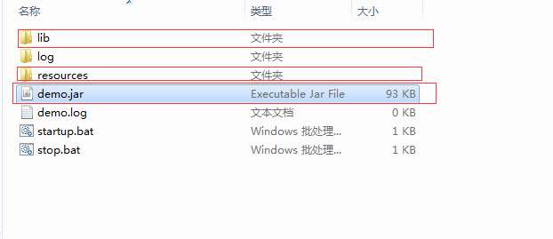
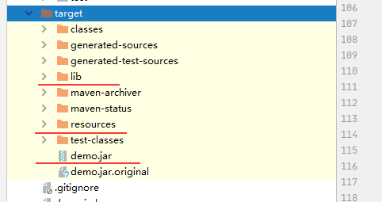

## 分离lib,resources打包     
### 效果图    
   
### 运行脚本    
```java -jar -Dloader.path=resources,lib  demo.jar ```     
[项目地址：github](https://github.com/weiey/separate-res-demo.git "地址")

### 修改pom.xml文件
``` <!-- 分离lib -->
<build>
         <finalName>${project.artifactId}</finalName>
         <defaultGoal>compile</defaultGoal>
         <plugins>
             <plugin>
                 <groupId>org.apache.maven.plugins</groupId>
                 <artifactId>maven-compiler-plugin</artifactId>
                 <version>3.1</version>
                 <configuration>
                     <encoding>UTF-8</encoding>
                 </configuration>
             </plugin>
 
 
             <!-- copy lib 分离lib -->
             <plugin>
                 <groupId>org.apache.maven.plugins</groupId>
                 <artifactId>maven-dependency-plugin</artifactId>
                 <executions>
                     <execution>
                         <id>copy-dependencies</id>
                         <phase>package</phase>
                         <goals>
                             <goal>copy-dependencies</goal>
                         </goals>
                         <configuration>
                             <!-- 依赖包输出目录，将来不打进jar包里 -->
                             <outputDirectory>${project.build.directory}/lib</outputDirectory>
                             <excludeTransitive>false</excludeTransitive>
                             <stripVersion>false</stripVersion>
                             <includeScope>runtime</includeScope>
                         </configuration>
                     </execution>
                 </executions>
             </plugin>
 
 
             <plugin>
                 <groupId>org.apache.maven.plugins</groupId>
                 <artifactId>maven-jar-plugin</artifactId>
                 <configuration>
                     <archive>
                         <!-- 指定配置文件目录，这样jar运行时会去找到同目录下的resources文件夹下查找 -->
                         <manifestEntries>
                             <Class-Path>resources/</Class-Path>
                         </manifestEntries>
                     </archive>
                     <!-- 打包时忽略的文件（也就是不打进jar包里的文件） -->
                     <excludes>
                         <exclude>static/**</exclude>
                         <exclude>templates/**</exclude>
                         <exclude>*.yml</exclude>
                         <exclude>*.properties</exclude>
                         <exclude>*.xml</exclude>
                         <exclude>*.txt</exclude>
                     </excludes>
                 </configuration>
             </plugin>
             <!-- copy资源文件 -->
             <plugin>
                 <artifactId>maven-resources-plugin</artifactId>
                 <executions>
                     <execution>
                         <id>copy-resources</id>
                         <phase>package</phase>
                         <goals>
                             <goal>copy-resources</goal>
                         </goals>
                         <configuration>
                             <resources>
                                 <resource>
 
                                     <directory>src/main/resources</directory>
 
                                 </resource>
                             </resources>
                             <outputDirectory>${project.build.directory}/resources</outputDirectory>
                         </configuration>
                     </execution>
                 </executions>
             </plugin>
 
             <plugin>
                 <groupId>org.springframework.boot</groupId>
                 <artifactId>spring-boot-maven-plugin</artifactId>
                 <version>2.0.3.RELEASE</version>
 
                 <configuration>
                     <fork>true</fork>
                     <mainClass>com.example.demo.DemoApplication</mainClass>
                     <!-- 解压出lib文件夹 -->
                     <layout>ZIP</layout>
                     <includes>
                         <include>
                             <groupId>nothing</groupId>
                             <artifactId>nothing</artifactId>
                         </include>
                     </includes>
                 </configuration>
                 <executions>
                     <execution>
                         <goals>
                             <goal>repackage</goal>
                         </goals>
                     </execution>
                 </executions>
 
             </plugin>
         </plugins>
     </build>
```   
##### 其实把上面复制了，只需修改下<mainClass>com.example.demo.DemoApplication</mainClass>执行 clean   package 即可。         

    
将lib,resources,jar复制到同目录下，直接运行即可。     

###问题与解决    
有些会发现自己项目运行不起来，但是没分离前是可以运行。
这种可以把完整jar解压lib出来,并对比打包出来lib。两种打包方式的lib不一样。
一般是依赖包的作用域 scope设置的问题。  
依赖包的作用域说明：     
   在定义项目的依赖项的时候，我们可以通过scope来指定该依赖项的作用范围。scope的取值有compile、runtime、test、provided、system和import。     
   * compile：这是依赖项的默认作用范围，即当没有指定依赖项的scope时默认使用compile。compile范围内的依赖项在所有情况下都是有效的，包括运行、测试和编译时。     
   * runtime：表示该依赖项只有在运行时才是需要的，在编译的时候不需要。这种类型的依赖项将在运行和test的类路径下可以访问。     
   * test：表示该依赖项只对测试时有用，包括测试代码的编译和运行，对于正常的项目运行是没有影响的。     
   * provided：表示该依赖项将由JDK或者运行容器在运行时提供，也就是说由Maven提供的该依赖项我们只有在编译和测试时才会用到，而在运行时将由JDK或者运行容器提供。     
   * system：当scope为system时，表示该依赖项是我们自己提供的，不需要Maven到仓库里面去找。指定scope为system需要与另一个属性元素systemPath一起使用，它表示该依赖项在当前系统的位置，使用的是绝对路径。         

  


